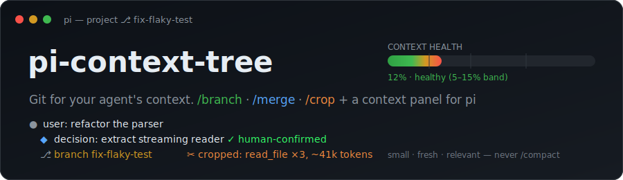
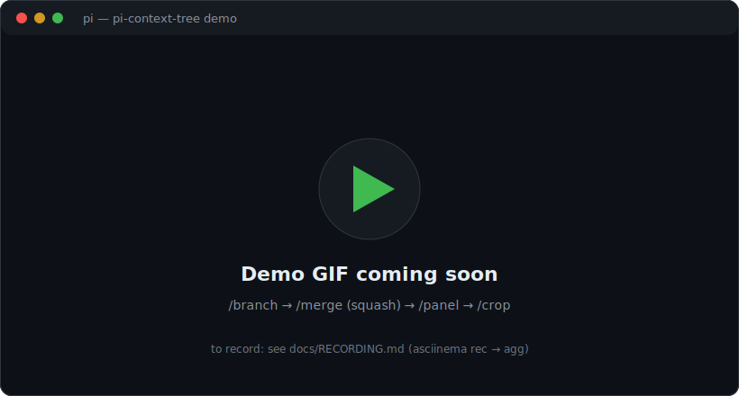
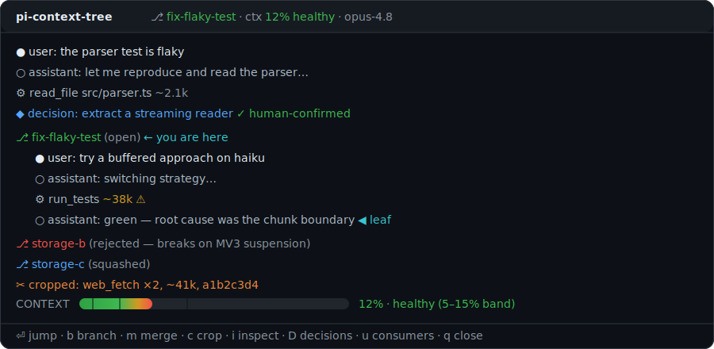

<p align="center">
  
</p>

<h1 align="center">pi-context-tree</h1>

<p align="center"><b>Git for your agent's context.</b><br>Branch off for side-quests, squash the conclusion back as a human-confirmed decision record, and surgically crop bloated tool output — all inside <a href="https://github.com/earendil-works/pi">pi</a>.</p>

<p align="center">
  <a href="https://github.com/navbytes/pi-context-tree/actions/workflows/ci.yml"></a>
  <a href="LICENSE"></a>
  = 22.19">
  
  
  
</p>

<p align="center">
  <a href="#why">Why</a> ·
  <a href="#features">Features</a> ·
  <a href="#demo">Demo</a> ·
  <a href="#install">Install</a> ·
  <a href="#quickstart">Quickstart</a> ·
  <a href="#usage">Usage</a> ·
  <a href="#the-context-panel">Panel</a> ·
  <a href="#development">Development</a> ·
  <a href="#documentation">Docs</a>
</p>

---

**pi-context-tree** is a [pi](https://github.com/earendil-works/pi) package that turns the session tree into a git-style workflow with a rich context panel. It keeps the working context **small, fresh, and relevant**, folds side-work back as clean reviewed commits, and never lets lossy auto-summaries touch your source material.

## Why

A model's attention is a fixed budget — softmax forces every token to compete for a slice. As the context window fills, retrieval degrades **measurably and non-uniformly**:

- **Context rot** (Chroma 2025, adopted by Anthropic's context-engineering guidance) — quality drops with input length, even on minimal tasks.
- **NoLiMa** (ICML 2025) — of 13 models claiming ≥128k windows, 11 fall below 50% of their short-context baseline by 32k tokens.
- **LongMemEval** — every model family scores higher on a focused prompt than on the same task buried in ~113k tokens. Pruning is a *quality* feature.

pi-context-tree treats the session like a **git repo**: the trunk is `master`, side work happens on branches, and `master` only receives clean, human-reviewed "commits" (decision records). Keep the trunk in a **5–15% band** (an opinionated heuristic — see the [spec's evidence section](docs/pi-context-tree-spec.md#part-0--design-philosophy-context-for-the-building-agent)), never `/compact`, and reuse context instead of regenerating it.

## Features

| | |
|---|---|
| **`/branch <name> [model]`** | Label the current point and fork off — optionally onto a cheaper model for the side-quest. The trunk model is restored on merge. |
| **`/merge`** | Close a branch: **squash** to a human-confirmed ◆ decision record, **discard** it, or run a **tournament** between sibling approaches (winner record + epitaphs for the losers). |
| **`/crop`** | Surgically stub fat tool/MCP results, or drop a whole Q&A turn — **append-only**, originals always recoverable. Interactive panel or headless `--auto --apply`. |
| **`/panel` (`Ctrl+T`)** | Full-screen TUI: the tree with per-node token costs, branch status colors, top context consumers, all decision records, and an entry inspector. |
| **Ambient health gauge** | A green→red context-health bar pinned above your prompt (band ticks at 5/15/40%), a color-hashed terminal title, and a one-time nudge before context rots. |
| **`pitree`** | A standalone, **read-only** forest CLI across all your pi projects, with dangling-branch detection. |

## Demo

<p align="center">
  <!-- TODO: replace docs/assets/demo-placeholder.svg with the recorded docs/assets/demo.gif, then delete the placeholder. See docs/RECORDING.md. -->
  
</p>

The full-screen context panel — the tree with token costs, branch status colors, the health gauge, and one-keystroke actions:

<p align="center">
  
</p>

> Prefer to click around? Open the interactive [TUI mockup](docs/pi-context-tree-mockup.html) in a browser — the keybindings match the implementation.

## Requirements

- [**pi**](https://github.com/earendil-works/pi) (the coding agent) — pinned to `@earendil-works/*@0.79.1`.
- **Node.js ≥ 22.19**.

`pi install` handles everything else; pi provides its core packages to the extension at runtime.

## Install

```sh
# as a pi package (recommended — survives pi restarts, auto-updates on reinstall):
pi install git:github.com/navbytes/pi-context-tree

# pin to a release:
pi install git:github.com/navbytes/pi-context-tree@v0.1.0
```

<details>
<summary>Development tree &amp; standalone CLI</summary>

```sh
# load packages/extension from source (don't combine with the installed package — duplicate commands):
pi remove git:github.com/navbytes/pi-context-tree   # if previously installed
pi -e /path/to/pi-context-tree

# standalone forest CLI (read-only, never writes):
node packages/pitree/dist/cli.js [dir] [--dangling] [--json]
node packages/pitree/dist/cli.js ui                  # session picker → read-only panel
```
</details>

## Quickstart

A 30-second tour of the core loop:

```sh
# 1. install into pi (survives restarts; re-run to update)
pi install git:github.com/navbytes/pi-context-tree

# 2. inside a pi session, fork off for a side-quest (optionally on a cheaper model)
/branch fix-flaky-test haiku-4.5

#    …do the noisy exploration…

# 3. fold just the conclusion back to the trunk as a reviewed decision record
/merge            # pick "squash" → edit the drafted record → save

# 4. see and prune what's in context any time
/panel            # browse the tree;  /crop to stub a 40k-token tool dump
```

> New to the workflow? The hands-on [**USAGE guide**](docs/USAGE.md) walks the full loop with worked examples.

## Usage

### `/branch <name> [model]`

Labels the current point (mirrored into pi's native labels — it doubles as a checkpoint) and opens a branch, optionally switching to a cheaper model for the side-quest. The trunk model is recorded and restored on merge.

```
/branch fix-flaky-test               # branch at the current leaf
/branch fix-flaky-test haiku-4.5     # …and run the branch on haiku (bare id or provider/id; Tab completes)
```

### `/merge [--squash | --no-llm | --discard | --tournament] [note…]`

Closes the nearest open branch at or above the leaf. With no flag, a selector offers the modes:

- **squash** — the branch model drafts a decision record from the branch transcript; it opens in your editor. **Nothing lands until you save** — closing the editor empty aborts everything. The confirmed record becomes one ◆ `custom_message` node at the branch label; the noisy turns stay on the branch (history is append-only, never deleted).
- **squash `--no-llm`** — same flow, but you write the record into the template yourself (no LLM call).
- **`--discard [note]`** — back to the label, nothing injected, branch marked rejected. The note lands on the close marker.
- **`--tournament`** — needs open sibling branches forked from the same point. The current branch wins: ONE combined record (winner + one-line drafted epitaphs for each loser), per-sibling close markers. Epitaphs keep the trunk model from re-proposing rejected approaches.

Merging never triggers pi's summarize-on-leave (`summarize:false` everywhere) — a decision record and a `BranchSummaryEntry` can never double-write.

### `/crop [--auto] [--apply] [--dry-run] [--min-tokens N] [--older-than N] [--keep glob]`

Surgically stubs out fat tool/MCP results. Interactive by default: opens the panel's crop view with rule-based pre-marking when `--auto` is given. `--auto --apply` skips the panel entirely (scriptable; the only mode available where pi has no TUI). `--dry-run` always wins — it reports and writes nothing.

Auto rules: ≥ `--min-tokens` (default 10k), older than `--older-than` assistant turns (default 2), never the latest result per tool (cropping those needs an explicit double-mark in the panel), never `--keep` matches.

**Two granularities, one mechanism.** The crop panel has a `t` toggle:

- **result mode** (default) — stub individual fat tool/MCP results, replaced by `[cropped: tool arg, ~tokens, sha8]`.
- **turn mode** — remove a whole **Q&A turn** (a user question + every answer/tool entry it spawned) *together*. Removing only the answer would orphan `tool_call`/`tool_result` pairs and break user/assistant alternation, so turns drop as a unit. A removed turn collapses to one label-free `[dropped turn — N entries, ~tokens, recoverable: sha8]` note. The current/leaf turn is protected; ◆ decision records can never be swept up. Turn removal is panel-only.

Both apply the same way: branch at the anchor, write ONE `ctree/crop-tail` reconstruction block plus a `ctree/crop` marker (`stubbed[]` and/or `dropped[]`). Originals stay in the JSONL, recoverable forever.

### `/panel` (also `Ctrl+T`) and `/decisions`

The full-screen context panel (an overlay over pi). `/decisions` opens it straight on the decisions view (and prints a text listing where no TUI is available, e.g. RPC mode). The panel stays up across actions: pick a mutation (jump/branch/merge/crop-apply), it executes in command context after re-validating the session, and the panel reopens with fresh state until you close it. `Ctrl+T` opens view-only in 0.79.1 (shortcuts get no command context and pi has no command-invoke API) — use `/panel` for mutations.

## The context panel

**Keys** (all views: `q` close · `esc` back/close · `↑↓`/`j k` move · `g G` top/bottom):

| view | keys |
|---|---|
| **tree** | `⏎` fold/unfold fork, jump leaf to entry · `b` branch from entry · `m` merge flow · `c` crop · `i` inspect entry · `D` decisions · `u` consumers |
| **crop** | `t` toggle result ⇄ turn mode · `space` mark/unmark (result: `space space` overrides latest-per-tool protection; turn: marks the whole Q&A turn) · `a` apply --auto rules (result mode) · `⏎` apply plan |
| **consumers** | `c` jump to crop |
| **decisions** | `⏎` jump to the ◆ record on the trunk |
| **inspect** | `c` pre-mark this entry for cropping |

**Reading the panel:**

- Glyphs: `●` user · `○` assistant · `⚙` tool/MCP result · `◆` decision record · `⎇` branch label · `✂` crop stub · `⚠` ≥10k-token entry.
- Branch status colors: open green · dangling yellow (open fork, no close marker — a branch-hygiene smell) · squashed blue · rejected/discarded red.
- Gauge bands at 5/15/40%: `<5%` low · `5–15%` healthy · `15–40%` filling · `>40%` red.
- `← you are here` marks the open fork you'd merge; `◀ leaf` marks the entry context currently ends at.
- In the chat itself, ◆ decision records render as cards (title · date · human-confirmed ✓ · outcome · red ✗ epitaphs).

### Ambient UI (outside the panel)

A **context-health gauge bar pinned above the prompt** (`CONTEXT ▓▓░ … N% band`, green→red, band ticks at 5/15/40%). Plus a footer status `⎇ branch · ctx N% band`, terminal title `project (branch) (pi)` color-hashed per branch, a one-time nudge when context crosses 40%, and a philosophy warning on `/compact`.

> pi owns its input *border* (for bash/thinking-mode indication) and re-asserts it, so an extension can't color it by health without fighting pi. The gauge bar (pinned via `setWidget`) is the safe, faithful realization — the same always-visible green→red signal, directly above where you type.

### `pitree` — the standalone forest CLI

```sh
pitree [dir] [--dangling] [--json]   # scan ~/.pi/agent/sessions across all projects (read-only)
pitree ui                            # session picker → the read-only panel
```

Flags dangling branches (open forks with no close marker) across every project. It **never writes** — enforced by a test.

## How it works

- **Append-only, always.** Every mutation (`/merge`, `/crop`) writes new `ctree/*` entries; existing session JSONL lines are never edited or deleted, so originals are recoverable forever.
- **Human-confirmed merges.** The only summarization is branch→decision-record, and it always passes through your editor before entering the trunk. `/merge` integrates with (never fights) pi's native summarize-on-leave and never double-writes a summary and a decision record.
- **Layered, pi-light core.** `core` imports nothing of pi (pure parsing/tree/estimation/planning); `tui` builds the panel on pi-tui; only the `extension` adapter touches pi's API. See [the architecture doc](docs/pi-context-tree-architecture.md) for the verified pi APIs (with file:line references) and the load-bearing design decisions.

## Development

```sh
npm install
npm test            # builds core/tui/pitree dist, then vitest in all workspaces (161 tests)
npm run check       # tsc --noEmit ×4 packages + biome
npm run fixtures    # regenerate committed fixtures (deterministic, byte-identical)
```

**Layout:** `core` (parser, tree, estimator, crop planner, panel view-model — zero pi deps) · `tui` (ContextPanel on pi-tui) · `extension` (the pi-facing surface, loaded from source via jiti) · `pitree` (standalone CLI/panel).

**Testing.** TDD throughout; `packages/core/src/testkit.ts` exports the deterministic `SessionBuilder` used by tests and fixtures. **Golden integration tests** (`packages/extension/test/golden/`) run the real pinned pi in `--mode rpc` against a mock OpenAI endpoint and pin the resulting session JSONL byte-for-byte. A **real-TUI test** boots pi in a pseudo-terminal via `expect(1)` and walks the panel keymap. Both self-skip when `pi`/`expect` are missing; re-record intended golden changes with `UPDATE_GOLDENS=1 npm test -w @pi-context-tree/extension`.

CI (`.github/workflows/ci.yml`): lint+types+unit per push · integration against the pinned pi (keyless) · a non-blocking `pi@latest` drift lane.

See [CONTRIBUTING.md](CONTRIBUTING.md) for the full conventions and the dev loop.

## Roadmap

- Upstream a `branchWithFilteredHistory` API to pi (replaces the crop reconstruction-block compromise with true per-entry filtered history).
- Mutating actions from `Ctrl+T` once pi exposes a command-invoke API (view-only today).
- v2 (out of v1 scope): web dashboard, RPC-attach mutation for the standalone panel, scope-selector export, global zoom-out view.

The full adoption/release plan and backlog live in [docs/ADOPTION.md](docs/ADOPTION.md) and [docs/HANDOVER.md](docs/HANDOVER.md).

## Documentation

- [**USAGE.md**](docs/USAGE.md) — hands-on guide (install, the core loop, commands by example, panel keys, recipes). **Start here.**
- [APP-FEATURES.md](docs/APP-FEATURES.md) — full feature inventory.
- [pi-context-tree-spec.md](docs/pi-context-tree-spec.md) — PRD/TRD v0.3 + the evidence/positioning section.
- [pi-context-tree-architecture.md](docs/pi-context-tree-architecture.md) — verified pi APIs (file:line) + design decisions.
- [pi-context-tree-mockup.html](docs/pi-context-tree-mockup.html) — interactive TUI mockup (open in a browser).

## Contributing

Contributions are welcome! Please read [CONTRIBUTING.md](CONTRIBUTING.md) for the TDD / append-only / conventional-commit conventions, and see [CHANGELOG.md](CHANGELOG.md) for release notes. Bug reports and feature requests use the [issue templates](.github/ISSUE_TEMPLATE).

## License

[MIT](LICENSE) © Naveen (navbytes).

## Acknowledgements

Built for [pi](https://github.com/earendil-works/pi) by earendil-works. The git-style context model and the "context is the new code" framing come from the *Context Engineering* deck that originated this project; the design philosophy is grounded in the context-rot / NoLiMa / LongMemEval research cited above.
