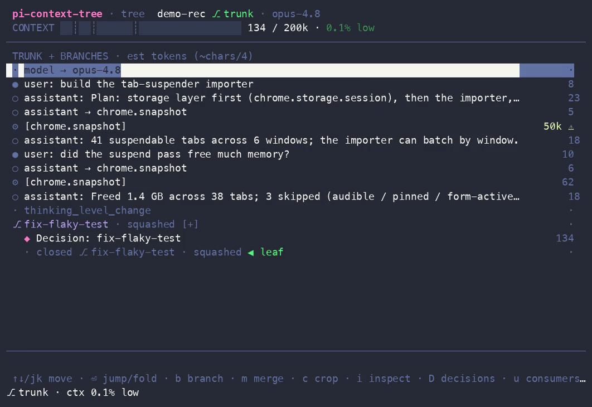

<p align="center">
  
</p>

<h1 align="center">pi-context-tree</h1>

<p align="center"><b>Git for your agent's context.</b><br>Branch off for side-quests, squash the conclusion back as a human-confirmed decision record, and surgically crop bloated tool output — all inside <a href="https://github.com/earendil-works/pi">pi</a>.</p>

<p align="center">
  <a href="https://github.com/navbytes/pi-context-tree/actions/workflows/ci.yml"></a>
  <a href="LICENSE"></a>
  = 22.19">
  
</p>

<p align="center">
  <a href="#why">Why</a> ·
  <a href="#features">Features</a> ·
  <a href="#demo">Demo</a> ·
  <a href="#status--compatibility">Status</a> ·
  <a href="#install">Install</a> ·
  <a href="#quickstart">Quickstart</a> ·
  <a href="#usage">Usage</a> ·
  <a href="#the-context-panel">Panel</a> ·
  <a href="#faq">FAQ</a> ·
  <a href="#development">Development</a> ·
  <a href="#documentation">Docs</a>
</p>

---

**pi-context-tree** is a [pi](https://github.com/earendil-works/pi) package that turns the session tree into a git-style workflow with a rich context panel. It keeps the working context **small, fresh, and relevant**, folds side-work back as clean reviewed commits, and never lets lossy auto-summaries touch your source material.

> **Never mutates your session JSONL** — every change is append-only and recoverable, verified by byte-for-byte golden tests against real pi.

## Why

As the context window fills, retrieval degrades **measurably and non-uniformly** — attention is a fixed budget and every token competes for a slice:

- **Context rot** (Chroma 2025, cited in Anthropic's context-engineering guidance) — answer quality drops with input length, even on trivial tasks.
- **NoLiMa** (ICML 2025) — of 13 models claiming ≥128k windows, 11 fall below half their short-context score by 32k tokens.

So pruning is a *quality* feature, not just a cost one. pi-context-tree treats the session like a **git repo**: a small trunk (`master`), side-work on branches, and `master` only ever receives clean, human-reviewed commits — never a lossy auto-summary. (Heuristic: keep the trunk in a [5–15% band](docs/pi-context-tree-spec.md#part-0--design-philosophy-context-for-the-building-agent).)

### Why not pi's built-in `/fork`, `/tree`, and `/compact`?

You can already *split* and *navigate* context natively — but the moves that keep the trunk clean aren't there. That's the gap this fills:

| You want to… | Native pi | pi-context-tree |
|---|---|---|
| explore a side-quest, then bring back **only the answer** | `/fork` + `/tree` split and navigate; leaving a branch **auto-summarizes** (lossy, unconfirmed) | `/branch` + `/merge --squash` fold back a **human-confirmed decision record** — the noisy turns stay on the branch, recoverable |
| reclaim a **bloated tool result** | `/compact` rewrites the *whole* context into a lossy summary you can't undo | `/crop` surgically stubs one fat result (or a whole Q&A turn) — **append-only and recoverable** |
| **see what's filling** the window and act on it | `/tree` switches branches | `/panel` adds per-node token costs, a top-consumers view, decision cards, and one-key crop/branch/merge |

## Features

| | |
|---|---|
| **`/branch <name> [model]`** | Label the current point and fork off — optionally onto a cheaper model for the side-quest. The trunk model is restored on merge. |
| **`/merge`** | Close a branch — **bare `/merge` squashes** to a human-confirmed ◆ decision record (`--pick` for the mode selector); also **discard** and **tournament** (winner record + epitaphs for the losers). |
| **`/crop`** | Stub fat tool/MCP results, or drop a whole Q&A turn — **append-only**, always recoverable. `--top` crops the biggest result inline; or review in the panel; or headless `--auto --apply`. |
| **`/undo`** | One-key revert of the last mutation — re-open a squashed/discarded branch, restore a crop, or undo a `/branch`. **Append-only**: nothing is deleted. |
| **`/panel` (`Ctrl+Q`)** | Full-screen TUI: the tree with per-node token costs, branch status colors, top context consumers, all decision records (`/decisions --export` to markdown), and an entry inspector. |
| **Ambient health gauge** | A green→red bar above your prompt with a **`▲` trend + jump attribution** — `ctx 38% ▲ +24% (chrome.snapshot)` tells you *what* to crop. Honest while estimating (band + `~est`, never a fake-precise %). Plus a hashed title and a 40% nudge. |
| **`pitree`** | A standalone, **read-only** forest CLI across all your pi projects, with dangling-branch detection. |

## Demo

<p align="center">
  
</p>

The full-screen context panel — the tree with token costs, branch status colors, the health gauge, and one-keystroke actions:

<p align="center">
  
</p>

> Prefer to click around? Open the interactive [TUI mockup](docs/pi-context-tree-mockup.html) in a browser — the keybindings match the implementation.

## Requirements

- [**pi**](https://github.com/earendil-works/pi) (the coding agent) — pinned to `@earendil-works/*@0.79.1`.
- **Node.js ≥ 22.19**.

`pi install` handles everything else; pi provides its core packages to the extension at runtime.

## Status & compatibility

**Maturity:** **v0.1.0 — the first public release.** Every command and panel view works against the pinned pi, covered by golden and real-TUI tests (see [Development](#development)). Bug reports and feedback are very welcome.

**pi version:** pinned to `@earendil-works/*@0.79.1`. A non-blocking CI lane runs the full integration suite against `pi@latest` to catch API drift early — but newer pi (0.80+) isn't officially supported yet. If something breaks on a newer pi, please [open an issue](https://github.com/navbytes/pi-context-tree/issues).

## Install

```sh
# from npm (recommended — versioned releases):
pi install npm:pi-context-tree

# …or straight from GitHub (tracks the default branch):
pi install git:github.com/navbytes/pi-context-tree

# update: re-run the install  ·  uninstall:
pi remove npm:pi-context-tree
```

> Pin a version for reproducibility: `pi install npm:pi-context-tree@0.1.0` (or `git:…@v0.1.0` from GitHub). The bare forms track the latest release / the default branch. See [Status &amp; compatibility](#status--compatibility).

<details>
<summary>Development tree &amp; standalone CLI</summary>

```sh
# load packages/extension from source (don't combine with the installed package — duplicate commands):
pi remove git:github.com/navbytes/pi-context-tree   # if previously installed
pi -e /path/to/pi-context-tree

# standalone forest CLI (read-only, never writes) — install globally from npm:
npm install -g @pi-context-tree/pitree
pitree [dir] [--dangling] [--json]
pitree ui                                            # session picker → read-only panel
```
</details>

## Quickstart

The core loop, end to end:

```sh
# 1. install into pi (survives restarts; re-run to update)
pi install npm:pi-context-tree

# 2. inside a pi session, fork off for a side-quest
/branch fix-flaky-test               # add a model id (e.g. haiku-4.5) to run the branch on a cheaper one

#    …do the noisy exploration…

# 3. fold just the conclusion back to the trunk as a reviewed decision record
/merge            # bare /merge = squash → opens $EDITOR; save to confirm, quit empty to abort

# 4. see and prune what's in context any time
/panel            # browse the tree;  /crop --top to stub the biggest tool dump

# changed your mind? one-key, append-only revert of the last branch/merge/crop
/undo
```

> New to the workflow? The hands-on [**USAGE guide**](docs/USAGE.md) walks the full loop with worked examples.

## Usage

### `/branch <name> [model]`

Labels the current point (mirrored into pi's native labels — it doubles as a checkpoint) and opens a branch, optionally switching to a cheaper model for the side-quest. The trunk model is recorded and restored on merge.

```
/branch fix-flaky-test               # branch at the current leaf
/branch fix-flaky-test haiku-4.5     # …and run the branch on haiku (bare id or provider/id; Tab completes)
```

### `/merge [--pick | --no-llm | --discard | --tournament] [note…]`

Closes the nearest open branch at or above the leaf. **Bare `/merge` squashes** — the 99% path, straight to the editor draft. `--pick` opens a selector with every mode; or pass a mode directly:

- **squash** (the default) — the branch model drafts a decision record from the branch transcript; it opens in your editor. **Nothing lands until you save** — closing the editor empty aborts everything. The confirmed record becomes one ◆ decision record at the branch label; the noisy turns stay on the branch (history is append-only, never deleted).
- **squash `--no-llm`** — same flow, but you write the record into the template yourself (no LLM call).
- **`--discard [note]`** — back to the label, nothing injected, branch marked rejected. The note lands on the close marker.
- **`--tournament`** — needs open sibling branches forked from the same point. The current branch wins: ONE combined record (winner + one-line drafted epitaphs for each loser), per-sibling close markers. Epitaphs keep the trunk model from re-proposing rejected approaches.

Merging never triggers pi's lossy summarize-on-leave — you never end up with both a summary and a decision record.

### `/crop [--top] [--auto] [--apply] [--dry-run] [--min-tokens N] [--older-than N] [--keep glob]`

Surgically stubs out fat tool/MCP results. Interactive by default: opens the panel's crop view with rule-based pre-marking when `--auto` is given. `--auto --apply` skips the panel entirely (scriptable; the only mode available where pi has no TUI). `--dry-run` always wins — it reports and writes nothing.

**`/crop --top`** is the one-shot path: it names the single biggest *unprotected* result and asks `✂ chrome.snapshot ~61k → crop? [y/N]` — one trusted decision instead of the blind rules sweep.

Auto rules: ≥ `--min-tokens` (default 10k), older than `--older-than` assistant turns (default 2), never the latest result per tool (cropping those needs an explicit double-mark in the panel), never `--keep` matches.

**Two granularities, one mechanism.** The crop panel has a `t` toggle:

- **result mode** (default) — stub individual fat tool/MCP results, replaced by `[cropped: tool arg, ~tokens, sha8]`.
- **turn mode** — remove a whole **Q&A turn** (a user question + every answer/tool entry it spawned) *together*. Removing only the answer would orphan `tool_call`/`tool_result` pairs and break user/assistant alternation, so turns drop as a unit. A removed turn collapses to one label-free `[dropped turn — N entries, ~tokens, recoverable: sha8]` note. The current/leaf turn is protected; ◆ decision records can never be swept up. Turn removal is panel-only.

Both branch at an anchor and leave the originals untouched on the previous branch — recoverable forever, nothing is ever deleted.

### `/undo`

One-key revert of the last pi-context-tree mutation — **append-only, nothing is deleted**. It navigates the leaf back to the anchor the mutation recorded, and a confirm names exactly what reverts:

- after a **squash / discard** → re-opens the branch at its tip (the decision record stays in history, off-path);
- after a **crop** → restores the original fat result or Q&A turn;
- after a **`/branch`** → drops back to where you branched.

It reverts the last *active* mutation (the most recent still on your path) — run it again to peel back further. This is the safety net that makes cropping and merging feel reversible.

### `/panel` (also `Ctrl+Q`) and `/decisions [--export path]`

The full-screen context panel (an overlay over pi). `/decisions` opens it straight on the decisions view (and prints a text listing where no TUI is available, e.g. RPC mode); **`/decisions --export [path]`** writes every trunk record to portable markdown (default `ctree-decisions.md`) to paste into a PR / ADR / Slack. The panel stays up across actions: pick a mutation (jump/branch/merge/crop-apply), it executes in command context after re-validating the session, and the panel reopens with fresh state until you close it. `Ctrl+Q` opens view-only in 0.79.1 (shortcuts get no command context and pi has no command-invoke API) — use `/panel` for mutations.

## The context panel

A full-screen overlay with five keyboard-driven views — **tree** (every entry with its token cost and branch status), **consumers** (what's eating the window), **decisions** (◆ records as cards), **crop**, and **inspect**. You act from where you see the problem: `b` branch, `m` merge, `c` crop, `⏎` jump/fold. The screenshot above is the tree view.

> **Full keymap, glyph legend, and reading guide → [USAGE §5 — The context panel](docs/USAGE.md#5-the-context-panel--keys).**

### Ambient UI (outside the panel)

A **context-health gauge bar pinned above the prompt** (`CONTEXT ▓▓░ … N% band`, green→red, band ticks at 5/15/40%). It carries a **`▲` trend** when context is filling fast and **attributes jumps** — `ctx 38% ▲ +24% (chrome.snapshot)` names *what* just bloated the window, right where you'll see it. While pi is still estimating (right after a session loads) it stays honest: the band word + a coarse `~est`, never a fake-precise percent. Plus a footer status `⎇ branch · ctx N% band`, a terminal title color-hashed per branch, a one-time nudge when context crosses 40%, and a philosophy warning on `/compact`.

### `pitree` — the standalone forest CLI

```sh
pitree [dir] [--dangling] [--json]   # scan ~/.pi/agent/sessions across all projects (read-only)
pitree ui                            # session picker → the read-only panel
```

Flags dangling branches (open forks with no close marker) across every project. It **never writes** — enforced by a test.

## How it works

- **Append-only, always.** Every mutation (`/merge`, `/crop`) writes new `ctree/*` entries; existing session JSONL lines are never edited or deleted, so originals are recoverable forever.
- **Human-confirmed merges.** The only summarization is branch→decision-record, and it always passes through your editor before entering the trunk. `/merge` integrates with (never fights) pi's native summarize-on-leave and never double-writes a summary and a decision record.
- **Layered, pi-light core.** `core` imports nothing of pi (pure parsing/tree/estimation/planning); `tui` builds the panel on pi-tui; only the `extension` adapter touches pi's API. See [the architecture doc](docs/pi-context-tree-architecture.md) for the verified pi APIs (with file:line references) and the load-bearing design decisions.

## FAQ

**`Ctrl+Q` doesn't open the panel.** It's view-only in pi 0.79.1 (shortcuts get no command context) — use `/panel` to mutate. If even view-only won't open, a terminal multiplexer may be intercepting the key; run `/panel` directly.

**My commands appear twice.** You have both the installed package and a `-e` dev tree loaded. Remove one — `pi remove git:github.com/navbytes/pi-context-tree`, or stop passing `-e`.

**The gauge says "est" or shows a `~`.** pi reports zero context usage right after a session loads, so until your first fresh turn the gauge shows the band word + a coarse `~Nk est` (no fake-precise percent on a guess); it switches to pi's exact number once a turn lands.

**Where did `/undo` put me?** `/undo` re-opens the last branch/crop by navigating your leaf back to where the mutation started — nothing is deleted. After undoing a squash you're back *on the branch* (the decision record is still in history, just off your current path); type and keep working, or `/undo` again to peel back the previous mutation.

**Does this ever rewrite or delete my session?** No — every change is append-only. `/merge` and `/crop` add new entries and the originals stay recoverable on the previous branch, verified by byte-for-byte golden tests against real pi.

**How do I pin a version?** `pi install npm:pi-context-tree@0.1.0` installs a specific release from npm (or `git:…@v0.1.0` from GitHub). The bare `npm:` / `git:` forms track the latest published release / the default branch and update whenever you reinstall.

## Development

```sh
npm install
npm test            # builds core/tui/pitree dist, then vitest in all workspaces
npm run check       # tsc --noEmit ×4 packages + biome
npm run fixtures    # regenerate committed fixtures (deterministic, byte-identical)
```

**Layout:** `core` (parser, tree, estimator, crop planner, panel view-model — zero pi deps) · `tui` (ContextPanel on pi-tui) · `extension` (the pi-facing surface, loaded from source via jiti) · `pitree` (standalone CLI/panel).

**Testing.** TDD throughout; `packages/core/src/testkit.ts` exports the deterministic `SessionBuilder` used by tests and fixtures. **Golden integration tests** (`packages/extension/test/golden/`) run the real pinned pi in `--mode rpc` against a mock OpenAI endpoint and pin the resulting session JSONL byte-for-byte. A **real-TUI test** boots pi in a pseudo-terminal via `expect(1)` and walks the panel keymap. Both self-skip when `pi`/`expect` are missing; re-record intended golden changes with `UPDATE_GOLDENS=1 npm test -w @pi-context-tree/extension`.

CI (`.github/workflows/ci.yml`): lint+types+unit per push · integration against the pinned pi (keyless) · a non-blocking `pi@latest` drift lane.

See [CONTRIBUTING.md](CONTRIBUTING.md) for the full conventions and the dev loop.

## Roadmap

- Upstream a `branchWithFilteredHistory` API to pi (replaces the crop reconstruction-block compromise with true per-entry filtered history).
- Mutating actions from `Ctrl+Q` once pi exposes a command-invoke API (view-only today).
- v2 (out of v1 scope): web dashboard, RPC-attach mutation for the standalone panel, scope-selector export, global zoom-out view.

## Documentation

- [**USAGE.md**](docs/USAGE.md) — hands-on guide (install, the core loop, commands by example, panel keys, recipes). **Start here.**
- [pi-context-tree-spec.md](docs/pi-context-tree-spec.md) — PRD/TRD v0.3 + the evidence/positioning section.
- [pi-context-tree-architecture.md](docs/pi-context-tree-architecture.md) — verified pi APIs (file:line) + design decisions.
- [pi-context-tree-mockup.html](docs/pi-context-tree-mockup.html) — interactive TUI mockup (open in a browser).

## Contributing

Contributions are welcome! Please read [CONTRIBUTING.md](CONTRIBUTING.md) for the TDD / append-only / conventional-commit conventions, and see [CHANGELOG.md](CHANGELOG.md) for release notes. Bug reports and feature requests use the [issue templates](.github/ISSUE_TEMPLATE).

## License

[MIT](LICENSE) © Naveen (navbytes).

## Acknowledgements

Built for [pi](https://github.com/earendil-works/pi) by earendil-works. The git-style context model and the "context is the new code" framing come from the *Context Engineering* deck that originated this project; the design philosophy is grounded in the context-rot and NoLiMa research cited above.
